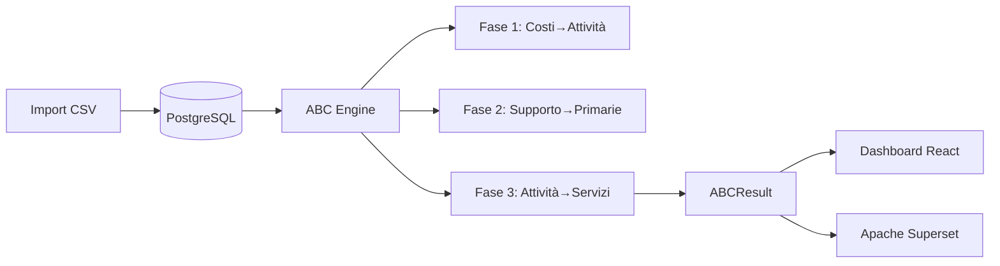

# Hotel ABC Platform

**Piattaforma decisionale Activity-Based Costing (ABC/ABS) per hotel multiservizio.**

[](https://www.docker.com/)
[](https://www.python.org/)
[](https://react.dev/)
[](https://fastapi.tiangolo.com/)
[](LICENSE)

---

## 📋 Panoramica

Hotel ABC Platform è una soluzione completa per il calcolo dei costi basati sulle attività (Activity-Based Costing) in ambienti hotelieri multiservizio. La piattaforma consente di:

- **Analizzare i costi** per centro di costo, attività e servizio
- **Allocare in modo preciso** i costi indiretti attraverso driver statistici
- **Calcolare margini** e redditività per ogni servizio offerto
- **Supportare decisioni** di pricing, investimento e ottimizzazione operativa
- **Integrare con AI** per forecasting, anomaly detection e scoperta driver

---

## 🚀 Quick Start

### Prerequisiti

| Requisito | Versione consigliata |
|-----------|---------------------|
| Docker Desktop | >= 4.20 |
| Docker Compose | v2.x |
| Git | >= 2.30 |

### 1. Configurazione ambiente

```bash
# Clona il repository
git clone https://github.com/your-org/hotel-abc-platform.git
cd hotel-abc-platform

# Copia e configura le variabili d'ambiente
cp .env.example .env
# Modifica le password in .env per l'ambiente di produzione
```

### 2. Avvio stack completo

```bash
docker-compose up -d
```

Il primo avvio può richiedere 2-5 minuti per il download delle immagini.

### 3. Seed dati iniziali (prima volta)

```bash
docker-compose exec backend python -m app.db.seed
```

### 4. Accesso alle applicazioni

| Servizio | URL | Credenziali default |
|----------|-----|---------------------|
| **Frontend React** | <http://localhost:3000> | `admin@hotel-abc.it` / `HotelABC2025!` |
| **API Docs (Swagger)** | <http://localhost:8000/api/docs> | — |
| **Apache Superset BI** | <http://localhost:8088> | `admin` / `admin` |

---

## 🏗️ Architettura

```
hotel-abc-platform/
├── backend/                    # API FastAPI (Python 3.11+)
│   ├── app/
│   │   ├── api/v1/endpoints/   # Router FastAPI
│   │   ├── core/
│   │   │   ├── abc_engine.py   # Motore ABC (3 fasi)
│   │   │   └── ai/             # Motori AI/ML
│   │   ├── db/                 # Database + seed
│   │   └── models/models.py    # SQLAlchemy models
│   ├── requirements.txt
│   └── requirements_ai.txt     # Dipendenze ML
├── frontend/                   # React 18 + Vite
│   └── src/
│       ├── pages/              # Pagine React
│       ├── lib/api.js          # Client API
│       └── store/              # Zustand stores
├── infra/
│   ├── postgres/init.sql
│   └── nginx/nginx.conf
├── superset/                   # Configurazione Superset
└── docker-compose.yml
```

### Servizi Docker

| Servizio | Descrizione | Porta |
|----------|-------------|-------|
| `postgres` | Database PostgreSQL 16 | 5432 |
| `redis` | Cache e rate limiting | 6379 |
| `backend` | API FastAPI | 8000 |
| `etl_worker` | Worker Prefect per ETL | - |
| `frontend` | React + Vite | 3000 |
| `superset` | BI & Analytics | 8088 |
| `nginx` | Reverse proxy SSL | 80/443 |

---

## 📊 Flusso dati ABC



### Algoritmo ABC a 3 livelli

1. **Fase 1 - Costi diretti**: Allocazione costi contabili (centri di costo) → attività
2. **Fase 2 - Ribaltamento**: Attività di supporto → attività primarie (iterativo)
3. **Fase 3 - Allocazione finale**: Attività → servizi (tramite driver)

---

## 💾 Formato file CSV

### Contabilità (`costs.csv`)

| Campo | Descrizione | Esempio |
|-------|-------------|---------|
| `conto` | Codice conto | 6010 |
| `descrizione` | Descrizione | Stipendi Reception |
| `centro_di_costo` | Codice centro | CC-REC |
| `tipo_costo` | Tipo | personale/struttura/ammortamento |
| `importo` | Importo € | 45000 |

```csv
conto,descrizione,centro_di_costo,tipo_costo,importo
6010,Stipendi Reception,CC-REC,personale,45000
6020,Acqua/Luce,CC-STR,struttura,8500
```

### Payroll (`payroll.csv`)

| Campo | Descrizione |
|-------|-------------|
| `matricola` | ID dipendente |
| `nome` | Nome completo |
| `attivita` | Codice attività |
| `ore` | Ore lavorate |
| `costo_orario` | €/ora |
| `percentuale` | % allocazione |

### Ricavi (`revenue.csv`)

| Campo | Descrizione |
|-------|-------------|
| `servizio` | Codice servizio |
| `ricavo` | Totale € |
| `volume` | Unità prodotte |

---

## 🤖 Funzionalità AI/ML

### Driver Discovery
Identifica automaticamente quali driver hanno maggior impatto sui costi:
- **Algoritmo**: Random Forest con SHAP
- **Output**: Peso % per ogni driver con confidence score

### Forecasting
Previsioni per metriche chiave:
- Notti vendute
- Coperti ristorante
- Eventi organizzati
- **Modello**: Prophet con stagionalità multi-livello

### Anomaly Detection
Rilevamento anomalie costi/volume:
- **Metodo**: Isolation Forest + analisi componenti principali
- **Use case**: Identificare sprechi o errori di registrazione

---

## 🛠️ Sviluppo

### Backend

```bash
cd backend

# Installazione dipendenze
pip install -r requirements.txt
pip install -r requirements_ai.txt  # Optional per AI features

# Avvio in modalità sviluppo
uvicorn app.main:app --reload --port 8000
```

### Frontend

```bash
cd frontend

# Installazione dipendenze
npm install

# Avvio in modalità sviluppo
npm run dev
```

### Struttura API

| Endpoint | Metodo | Descrizione |
|----------|--------|-------------|
| `/api/v1/auth/login` | POST | Autenticazione |
| `/api/v1/periods` | GET | Lista periodi contabili |
| `/api/v1/costs` | POST | Import costi |
| `/api/v1/simulation` | POST | Esegui calcolo ABC |
| `/api/v1/reports` | GET | Report ABC |
| `/api/v1/ai/driver-discovery` | GET | Analisi driver |
| `/api/v1/ai/forecast` | GET | Previsioni metriche |
| `/api/v1/ai/anomalies` | GET | Anomalie rilevate |

---

## 📦 Deployment Produzione

### Variabili d'ambiente critiche

```bash
# .env production
POSTGRES_PASSWORD=<password_sicura>
REDIS_PASSWORD=<password_sicura>
SECRET_KEY=<chiave_32+_chars>
SUPERSET_SECRET_KEY=<chiave_sicura>
ENVIRONMENT=production
```

### Comandi utili

```bash
# Verifica salute servizi
docker-compose ps

# Visualizza log in tempo reale
docker-compose logs -f backend

# Backup database
docker-compose exec postgres pg_dump -U hotel_user hotel_abc > backup.sql

# Rigenera dati di esempio
docker-compose exec backend python scripts/generate_sample_data.py
```

---

## 🧪 Testing

```bash
# Backend
cd backend
pytest tests/ -v

# Frontend
cd frontend
npm run test
```

---

## 📈 Monitoring

- **Prometheus metrics**: `http://localhost:8000/metrics`
- **Health check**: `http://localhost:8000/health`
- **Logs strutturati**: JSON via structlog

---

## 🤝 Contribuire

1. Fork il repository
2. Crea feature branch (`git checkout -b feature/nome-feature`)
3. Commit changes (`git commit -m 'Add feature'`)
4. Push branch (`git push origin feature/nome-feature`)
5. Apri Pull Request

---

## 📄 Licenza

MIT License - vedere [LICENSE](LICENSE) per dettagli.

---

## 📞 Supporto

- **Documentazione API**: <http://localhost:8000/api/docs>
- **Issues**: GitHub Issues
- **Email**: dev@hotel-abc.it

## Requisiti di sistema

| Componente | Versione minima | Consigliata |
|------------|-----------------|-------------|
| Docker | 24.0 | 25.0+ |
| Docker Compose | 2.20 | 2.27+ |
| RAM | 8GB | 16GB |
| Storage | 20GB | 50GB+ |

## Installazione rapida

```bash
# 1. Clona il repository
git clone https://github.com/your-org/hotel-abc-platform.git
cd hotel-abc-platform

# 2. Configura l'ambiente
cp .env.example .env

# 3. Modifica le variabili in .env
nano .env  # o usare il tuo editor preferito

# 4. Avvia i servizi
docker-compose up -d

# 5. Inizializza il database
docker-compose exec backend python -m app.db.seed
```

## Variabili d'ambiente

### File `.env`

```bash
# Database
POSTGRES_PASSWORD=hotel_secure_2025
POSTGRES_USER=hotel_user
POSTGRES_DB=hotel_abc

# Redis
REDIS_PASSWORD=redis_secure_2025

# Security
SECRET_KEY=change_me_in_production_32chars_min
SUPERSET_SECRET_KEY=superset_secret_2025_change_me

# Environment
ENVIRONMENT=development
LOG_LEVEL=info
```

### Variabili obbligatorie

| Variabile | Descrizione | Default |
|-----------|-------------|---------|
| `POSTGRES_PASSWORD` | Password database | `hotel_secure_2025` |
| `SECRET_KEY` | JWT secret key | da modificare |
| `ENVIRONMENT` | `development` o `production` | `development` |

## Configurazione per ambiente

### Sviluppo

```bash
# docker-compose.yml
FRONTEND_TARGET: development
ENVIRONMENT: development
```

### Produzione

```bash
# docker-compose.yml
FRONTEND_TARGET: production
ENVIRONMENT: production
```

Per la produzione, aggiungi:
- Certificati SSL in `infra/nginx/ssl/`
- Configurazione DNS
- Backup automatici

## Verifica installazione

```bash
# Controlla lo stato dei container
docker-compose ps

# Verifica l'API
curl http://localhost:8000/health

# Verifica il frontend
curl http://localhost:3000
```

## Note per Windows

Usa PowerShell o WSL2 per evitare problemi di permessi con Docker Desktop.

## Troubleshooting installazione

### Porta già in uso

```bash
# Trova il processo che usa la porta
netstat -ano | findstr :3000

# Su Linux/macOS
lsof -i :3000
```

### Problemi di permessi Docker

```bash
# Su Linux
sudo usermod -aG docker $USER
newgrp docker
```

### Volume Docker corrotto

```bash
# Rimuovi i volumi (ATTENZIONE: cancella tutti i dati)
docker-compose down -v
docker volume prune
```

## Primo accesso

1. Apri il browser e vai su `http://localhost:3000`
2. Accedi con le credenziali:
   - Email: `admin@hotel-abc.it`
   - Password: `HotelABC2025!`

## Menu principale

| Sezione | Descrizione |
|---------|-------------|
| **Dashboard** | KPI e metriche globali |
| **Periodi** | Gestione periodi contabili |
| **Import** | Caricamento file CSV |
| **Allocazioni** | Regole di allocazione ABC |
| **Calcolo ABC** | Esegui il calcolo |
| **Report** | Visualizza risultati |
| **AI Insights** | Analisi predittive |

## Flusso di lavoro tipico

### 1. Configura un periodo contabile

- Vai su **Periodi** → **Nuovo Periodo**
- Inserisci nome, data inizio, data fine
- Salva

### 2. Importa i dati

- **Importa file CSV** in ordine:
  1. Contabilità (`costs.csv`)
  2. Payroll (`payroll.csv`)
  3. Ricavi (`revenue.csv`)

- Ogni file deve seguire lo schema definito

### 3. Definisci le regole di allocazione

- Vai su **Allocazioni**
- Per ogni centro di costo, definisci:
  - Attività target
  - Driver di allocazione
  - Percentuali

### 4. Esegui il calcolo ABC

- Vai su **Calcolo ABC**
- Seleziona il periodo
- Clicca **Esegui calcolo**
- Attendi il completamento

### 5. Analizza i risultati

- Vai su **Dashboard** per:
  - Margine lordo per servizio
  - Incidenza costi
  - Performance rispetto al budget

## Interpretazione dei risultati

### Indicatori chiave (KPI)

| KPI | Descrizione | Valori positivi |
|-----|-------------|-----------------|
| **Ricavi Totali** | Fatturato periodo | Più alto è meglio |
| **Costi Totali** | Spesa operativa | Più basso è meglio |
| **Margine Lordo** | Ricavi - Costi | > 0 è profitto |
| **Margine %** | Margine/Ricavi × 100 | > 20% è buono |
| **Incidenza Personale** | % costi sui ricavi | < 35% è sano |

### Esempi di analisi

**Servizio in perdita**
- Margine negativo = costi > ricavi
- Azioni: aumentare prezzi, ridurre costi, o riconsiderare l'offerta

**Margine basso (< 10%)**
- Servizio poco redditizio
- Analizzare breakdown costi per individuare optimization

## AI Insights

### Driver Discovery

Mostra quale driver influenza di più i costi:
- ore lavorate
- notti vendute
- coperti
- mq (metri quadri)
- eventi

### Forecasting

Previsione per i prossimi 6 mesi di:
- Notti vendute
- Coperti ristorante

### Anomaly Detection

Periodi con anomalie costi/volume:
- Rosso = anomalia critica
- Giallo = da verificare

## Base URL

```
http://localhost:8000/api/v1
```

## Autenticazione

Tutti gli endpoint (eccetto `/auth/login`) richiedono l'autenticazione tramite token Bearer JWT.

### Login

```http
POST /auth/login
Content-Type: application/json

{
  "username": "admin@hotel-abc.it",
  "password": "HotelABC2025!"
}
```

**Response:**

```json
{
  "access_token": "eyJhbGciOiJIUzI1NiIsInR5cCI6IkpXVCJ9...",
  "token_type": "bearer"
}
```

### Headers richiesti

```http
Authorization: Bearer <access_token>
Content-Type: application/json
```

## Endpoints

### Periodi contabili

#### Lista periodi

```http
GET /periods
```

**Response:**

```json
[
  {
    "id": "550e8400-e29b-41d4-a716-446655440000",
    "name": "2025-Q1",
    "start_date": "2025-01-01",
    "end_date": "2025-03-31",
    "status": "active"
  }
]
```

#### Crea periodo

```http
POST /periods
{
  "name": "2025-Q2",
  "start_date": "2025-04-01",
  "end_date": "2025-06-30"
}
```

#### Dettaglio periodo

```http
GET /periods/{period_id}
```

### Costi

#### Lista costi

```http
GET /costs?period_id={period_id}
```

#### Crea costo

```http
POST /costs
{
  "period_id": "uuid",
  "cost_center_id": "uuid",
  "cost_type": "personale",
  "amount": 45000.00,
  "description": "Stipendi Reception"
}
```

### Allocazioni

#### Lista allocazioni

```http
GET /allocations?period_id={period_id}
```

#### Crea allocazione

```http
POST /allocations
{
  "period_id": "uuid",
  "level": "costo_ad_attivita",
  "source_cost_center_id": "uuid",
  "target_activity_id": "uuid",
  "driver_values": {"activity_id": 1000},
  "allocation_pct": 0.5
}
```

### Simulazione ABC

#### Esegui calcolo

```http
POST /simulation/run
{
  "period_id": "uuid"
}
```

**Response:**

```json
{
  "period_id": "uuid",
  "status": "completed",
  "total_cost": 1250000.00,
  "total_revenue": 1850000.00,
  "total_margin": 600000.00,
  "service_results": [
    {
      "service_id": "uuid",
      "service_name": "Camera Doppia",
      "revenue": 500000.00,
      "total_cost": 350000.00,
      "gross_margin": 150000.00,
      "margin_pct": 30.0
    }
  ]
}
```

### Report

#### KPI dashboard

```http
GET /reports/kpi?period_id={period_id}
```

**Response:**

```json
{
  "total_revenue": 1850000.00,
  "total_cost": 1250000.00,
  "total_margin": 600000.00,
  "total_margin_pct": 32.43,
  "labor_cost_incidence_pct": 45.2
}
```

#### Report completo

```http
GET /reports?period_id={period_id}
```

### AI Endpoints

#### Driver Discovery

```http
GET /ai/driver-discovery
```

**Response:**

```json
[
  {
    "driver_name": "ore_lavorate",
    "importance_pct": 45.5,
    "confidence_score": "Alta",
    "explanation": "Correlazione forte con i costi overhead"
  }
]
```

#### Forecast

```http
GET /ai/forecast?metric=notti_vendute&periods=6
```

**Response:**

```json
[
  {
    "date": "2025-06-01",
    "predicted_value": 125.5,
    "lower_bound": 110.0,
    "upper_bound": 140.0
  }
]
```

#### Anomaly Detection

```http
GET /ai/anomalies
```

**Response:**

```json
[
  {
    "record_id": "P-10",
    "anomaly_score": 0.95,
    "root_cause_driver": "costo_lavoro",
    "explanation": "Costo lavoro anomalo per il volume"
  }
]
```

## Codici di errore

| Codice | Descrizione |
|--------|-------------|
| 400 | Bad Request - Dati non validi |
| 401 | Unauthorized - Token mancante o scaduto |
| 403 | Forbidden - Permessi insufficienti |
| 404 | Not Found - Risorsa non trovata |
| 500 | Internal Server Error |

## Rate Limiting

- 100 richieste/minuto per IP
- 1000 richieste/minuto per utente autenticato

## Schema OpenAPI

Lo schema OpenAPI è disponibile all'indirizzo:
```
http://localhost:8000/api/openapi.json
```

La documentazione Swagger interattiva è disponibile all'indirizzo:
```
http://localhost:8000/api/docs
```

## Stack tecnologico

### Backend

| Tecnologia | Versione | Scopo |
|------------|----------|-------|
| Python | 3.11+ | Runtime |
| FastAPI | 0.111 | Framework API |
| SQLAlchemy | 2.0 | ORM |
| PostgreSQL | 16 | Database |
| Redis | 7 | Cache |
| Polars | 1.0+ | Elaborazione dati |
| LightGBM | 4.3+ | ML engine |
| Prophet | 1.1+ | Forecasting |

### Frontend

| Tecnologia | Versione | Scopo |
|------------|----------|-------|
| React | 18 | UI Library |
| Vite | 5 | Build tool |
| Material UI | 5 | Componenti |
| Recharts | 2.12 | Grafici |
| Zustand | 4.5 | State management |
| React Query | 5 | Data fetching |

### Infrastruttura

| Tecnologia | Scopo |
|------------|-------|
| Docker | Containerizzazione |
| Docker Compose | Orchestrazione |
| Nginx | Reverse proxy |
| Apache Superset | BI & Analytics |
| Prefect | ETL orchestration |

## Diagramma architettura

```
┌─────────────────────────────────────────────────────────────┐
│                        Client Browser                        │
│                      (React + Vite)                           │
└────────────────────┬────────────────────────────────────────┘
                     │ HTTPS
┌────────────────────▼────────────────────────────────────────┐
│                      Nginx Reverse Proxy                       │
│                   (Port 80/443)                              │
└─────────────┬──────────────┬───────────────┬─────────────────┘
              │              │               │
     ┌────────▼─┐    ┌───────▼───┐   ┌───────▼────────┐
     │ Frontend │    │  Backend  │   │   Superset     │
     │  :3000   │    │   :8000   │   │    :8088       │
     └──────────┘    └───────┬───┘   └────────────────┘
                             │
        ┌──────────────────────┼──────────────────────┐
        │                      │                      │
  ┌─────▼─────┐        ┌─────▼─────┐        ┌───────▼──────┐
  │ Postgres  │        │   Redis   │        │ ETL Worker   │
  │   :5432   │        │   :6379   │        │ (Prefect)    │
  └───────────┘        └───────────┘        └──────────────┘
```

## Componenti principali

### ABCEngine (backend/app/core/abc_engine.py)

Motore principale per il calcolo ABC. Implementa 3 fasi:

1. **Phase 1 - Costi diretti**
   - `CostRecord` → allocazione su `ActivityCost`
   - `LaborRecord` → costi orari diretti

2. **Phase 2 - Ribaltamento supporto**
   - Attività di supporto → attività primarie
   - Algoritmo iterativo con convergenza

3. **Phase 3 - Allocazione a servizi**
   - `ActivityCost` → `ServiceResult`
   - Driver-based allocation

### AI Engine (backend/app/core/ai/)

| Modulo | Funzione |
|--------|----------|
| `driver_discovery.py` | Random Forest + SHAP per feature importance |
| `forecasting.py` | Prophet per previsioni con stagionalità |
| `anomaly_detection.py` | Isolation Forest per outlier detection |
| `data_fetcher.py` | Estrazione dati dal database |

### Modelli database

Entità principali:
- `Period` - Periodo contabile
- `CostCenter` - Centro di costo
- `Activity` - Attività
- `Service` - Servizio
- `CostRecord` - Registro costi
- `AllocationRule` - Regola di allocazione
- `ABCResult` - Risultato calcolo

## Flusso dati

```
CSV Upload
    ↓
Parser & Validazione
    ↓
PostgreSQL
    ↓
ABC Engine (3 fasi)
    ↓
ABCResult
    ↓
┌────────────┴────────────┐
│                         │
▼                         ▼
Dashboard              Superset
React                  BI Reports
```

## Sicurezza

- **Autenticazione**: JWT con refresh token
- **Autorizzazione**: RBAC (Role-Based Access Control)
- **CORS**: Configurabile via environment
- **HTTPS**: Obbligatorio in produzione

## Performance

- **Database pooling**: SQLAlchemy async
- **Cache**: Redis per rate limiting e sessioni
- **Query optimization**: Polars per elaborazione dati
- **Background tasks**: Prefect per ETL

## Monitoring

- **Health check**: `/health` endpoint
- **Metrics**: Prometheus su `/metrics`
- **Logging**: JSON structured via structlog

## Entità principali

### Period (Periodi contabili)

```sql
CREATE TABLE periods (
    id UUID PRIMARY KEY,
    name VARCHAR(100) NOT NULL,
    start_date DATE NOT NULL,
    end_date DATE NOT NULL,
    status VARCHAR(20) DEFAULT 'draft',
    created_at TIMESTAMP DEFAULT NOW()
);
```

### CostCenter (Centri di costo)

```sql
CREATE TABLE cost_centers (
    id UUID PRIMARY KEY,
    code VARCHAR(20) UNIQUE NOT NULL,
    name VARCHAR(100) NOT NULL,
    type VARCHAR(50), -- personale, struttura, ammortamento
    description TEXT
);
```

### Activity (Attività)

```sql
CREATE TABLE activities (
    id UUID PRIMARY KEY,
    code VARCHAR(20) UNIQUE NOT NULL,
    name VARCHAR(100) NOT NULL,
    is_primary BOOLEAN DEFAULT false,
    cost_center_id UUID REFERENCES cost_centers(id)
);
```

### Service (Servizi)

```sql
CREATE TABLE services (
    id UUID PRIMARY KEY,
    code VARCHAR(20) UNIQUE NOT NULL,
    name VARCHAR(100) NOT NULL,
    type VARCHAR(50),
    output_unit VARCHAR(20) -- notte, coperto, evento
);
```

### CostRecord (Voci costi)

```sql
CREATE TABLE cost_records (
    id UUID PRIMARY KEY,
    period_id UUID REFERENCES periods(id),
    cost_center_id UUID REFERENCES cost_centers(id),
    cost_type VARCHAR(50), -- personale, struttura, ammortamento, utilities
    amount DECIMAL(12,2),
    description TEXT,
    created_at TIMESTAMP DEFAULT NOW()
);
```

### AllocationRule (Regole di allocazione)

```sql
CREATE TABLE allocation_rules (
    id UUID PRIMARY KEY,
    period_id UUID REFERENCES periods(id),
    level VARCHAR(50), -- costo_ad_attivita, attivita_ad_attivita, attivita_a_servizio
    source_cost_center_id UUID REFERENCES cost_centers(id),
    source_activity_id UUID REFERENCES activities(id),
    target_activity_id UUID REFERENCES activities(id),
    target_service_id UUID REFERENCES services(id),
    driver_type VARCHAR(50), -- ore, mq, notti, coperti, eventi
    allocation_pct DECIMAL(5,4),
    priority INTEGER DEFAULT 0
);
```

### ABCResult (Risultati ABC)

```sql
CREATE TABLE abc_results (
    id UUID PRIMARY KEY,
    period_id UUID REFERENCES periods(id),
    calculation_date TIMESTAMP DEFAULT NOW(),
    total_cost DECIMAL(14,2),
    total_revenue DECIMAL(14,2),
    total_margin DECIMAL(14,2),
    unallocated_amount DECIMAL(14,2),
    iterations_used INTEGER,
    status VARCHAR(20)
);
```

## Relazioni

```
Period
  ├── CostRecords (N:1)
  ├── AllocationRules (N:1)
  └── ABCResults (1:1)

CostCenter
  ├── CostRecords (N:1)
  ├── Activities (N:1)
  └── AllocationRules (source N:1)

Activity
  └── AllocationRules (source/target N:1)

Service
  └── AllocationRules (target N:1)
```

## Indici consigliati

```sql
CREATE INDEX idx_cost_records_period ON cost_records(period_id);
CREATE INDEX idx_allocation_rules_period ON allocation_rules(period_id);
CREATE INDEX idx_cost_records_costcenter ON cost_records(cost_center_id);
```

## Stato attuale (dopo setup completo)

- **Backend**: FastAPI in ascolto su `http://localhost:8000`
- **Database**: SQLite (`backend/hotel_abc.db`) con dati reali
- **Frontend**: React (Vite) su `http://localhost:3000` (da avviare)
- **Dati**: 11 periodi contabili (mag 2025 – apr 2026), 66 risultati ABC, 99 driver values per AI

## Avvio rapido (senza Docker)

### 1. Backend
```powershell
cd backend
python -m uvicorn app.main:app --reload --host 0.0.0.0 --port 8000
```
Verifica: `http://localhost:8000/health` → `{"status":"ok","version":"0.1.0"}`

### 2. Frontend (in un altro terminale)
```powershell
cd frontend
npm install  # la prima volta
npm run dev
```
Apri `http://localhost:3000`

### 3. API Endpoints principali

| Endpoint | Descrizione |
|----------|-------------|
| `GET /health` | Health check |
| `GET /api/v1/periods/` | Lista periodi contabili |
| `GET /api/v1/services/` | Lista servizi |
| `GET /api/v1/activities/` | Lista attività |
| `GET /api/v1/costs/{period_id}` | Voci di costo per periodo |
| `GET /api/v1/labor/{period_id}` | Allocazioni personale |
| `POST /api/v1/reports/calculate/{period_id}` | Calcola ABC per periodo (salva in background) |
| `GET /api/v1/reports/abc/{period_id}` | Risultati ABC per periodo |
| `GET /api/v1/ai/driver-discovery` | Driver discovery (raccomandazioni) |
| `GET /api/v1/ai/forecast?metric=notti_vendute&periods=6` | Forecasting metriche |
| `GET /api/v1/ai/anomalies` | Anomaly detection |
| `GET /api/v1/imports/accounting` | Import contabilità (CSV/Excel) |
| `GET /api/v1/mapping/rules` | CRUD mapping rules |

### 4. Script di utilità (da cartella `backend/scripts/`)

| Script | Descrizione |
|--------|-------------|
| `setup_all.py` | Inizializzazione completa DB (migrazione, seed, storico, driver values, calcoli ABC) |
| `migrate_to_multitenancy.py` | Aggiunge schema multi-tenant (tabelle hotels) |
| `populate_min_history.py` | Genera 12 mesi di dati contabili (costi, lavoro, ricavi) |
| `populate_presumed_costs.py` | Aggiunge costi presunti e regole Costo→Attività per ultimo periodo |
| `populate_driver_values.py` | Genera valori driver (notti, coperti, ore, camere) per AI |
| `calculate_all_periods.py` | Ricalcola ABC per tutti i periodi (dopo modifiche) |
| `run_abc_calculation.py` | Calcola ABC per il periodo più recente (singolo) |

**Esempio: setup completo da zero (SQLite)**
```powershell
cd backend
python -m scripts.setup_all
```

## Docker (stack completo)

```bash
# Build e avvio
docker-compose up -d

# Verifica servizi
docker-compose ps

# Logs
docker-compose logs -f backend
docker-compose logs -f frontend

# Stop
docker-compose down
```

Servizi esposti:
- Backend: http://localhost:8000
- Frontend: http://localhost:3000
- Superset (BI): http://localhost:8088
- PostgreSQL: localhost:5432 (user: `hotel_user`, password: da `.env`)

## Database

### Schema principali
- `hotels` – tenant (multi-tenancy)
- `accounting_periods` – periodi contabili (chiusura)
- `cost_centers` – centri di costo
- `activities` – attività operative
- `services` – servizi offerti
- `cost_items` – voci di costo (da contabilità)
- `labor_allocations` – ore/dipendent per attività
- `service_revenues` – ricavi per servizio
- `allocation_rules` – regole di ribaltamento ABC
- `abc_results` – risultati calcoli ABC
- `driver_values` – valori driver per AI
- `mapping_rules` – regole mapping codici esterni
- `data_import_logs` – storico import

### Query utili

```sql
-- Periodi e risultati ABC
SELECT p.name, COUNT(a.id) as num_results
FROM accounting_periods p
LEFT JOIN abc_results a ON a.period_id = p.id
GROUP BY p.id ORDER BY p.year DESC, p.month DESC;

-- Driver values per periodo
SELECT d.name, SUM(dv.value) as total
FROM driver_values dv
JOIN cost_drivers d ON dv.driver_id = d.id
WHERE dv.period_id = '<period_id>'
GROUP BY dv.driver_id;
```

## AI & Forecasting

- **Driver Discovery**: `GET /api/v1/ai/driver-discovery` – suggerisce driver per attività/servizi basandosi su correlazione storica.
- **Forecasting**: `GET /api/v1/ai/forecast?metric=notti_vendute&periods=6` – previsione metriche (LightGBM).
- **Anomaly Detection**: `GET /api/v1/ai/anomalies` – rileva outlier nei dati storici.

Dati necessari: `driver_values` (almeno 10 periodi). Attualmente: 11 periodi → OK.

## Troubleshooting

### Backend non parte
- Verifica `.env` presente in `backend/` con `DATABASE_URL` (opzionale, default SQLite)
- Installa dipendenze: `pip install -r requirements.txt`
- Assicurati che la porta 8000 sia libera

### Frontend build fallisce
- `rm -rf node_modules package-lock.json && npm install`
- Verifica `VITE_API_URL` in `.env` (frontend) punti a `http://localhost:8000`

### Errori ABC (risultati vuoti)
- Esegui `scripts/setup_all.py` per rigenerare dati
- Verifica che esistano `cost_items`, `labor_allocations`, `service_revenues` per il periodo
- controlla regole `allocation_rules` attive

### Multi-tenancy
- Hotel default: `DEMO` (creato da migrate_to_multitenancy.py)
- Tutte le query devono filtrare per `hotel_id` (incluso negli import)

## Note sviluppo

- **Python**: 3.11+ (consigliato 3.12)
- **Node**: 18+ LTS
- **Database**: SQLite per sviluppo, PostgreSQL per produzione
- **AI Models**: LightGBM, Prophet, IsolationForest (installare con `pip install lightgbm prophet scikit-learn`)

## Prossimi step

- [ ] Docker: far girare stack completo (Postgres, Redis, Backend, Frontend, Superset)
- [ ] Test suite completa (pytest)
- [ ] Documentazione API Swagger interattiva: http://localhost:8000/docs
- [ ] Integrazione PMS reale (CSV/API)
- [ ] Export report Excel/PDF

---

**Ultimo aggiornamento**: 2026-05-11  
**Versione**: 0.4.0-dev
