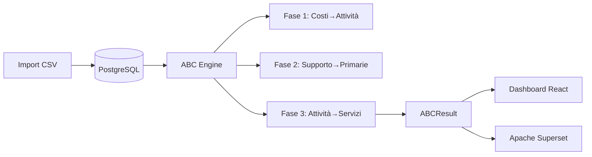

# Hotel ABC Platform

**Piattaforma decisionale Activity-Based Costing (ABC/ABS) per hotel multiservizio.**

[](https://www.docker.com/)
[](https://www.python.org/)
[](https://react.dev/)
[](https://fastapi.tiangolo.com/)
[](LICENSE)

---

## 📋 Panoramica

Hotel ABC Platform è una soluzione completa per il calcolo dei costi basati sulle attività (Activity-Based Costing) in ambienti hotelieri multiservizio. La piattaforma consente di:

- **Analizzare i costi** per centro di costo, attività e servizio
- **Allocare in modo preciso** i costi indiretti attraverso driver statistici
- **Calcolare margini** e redditività per ogni servizio offerto
- **Supportare decisioni** di pricing, investimento e ottimizzazione operativa
- **Integrare con AI** per forecasting, anomaly detection e scoperta driver

---

## 🚀 Quick Start

### Prerequisiti

| Requisito | Versione consigliata |
|-----------|---------------------|
| Docker Desktop | >= 4.20 |
| Docker Compose | v2.x |
| Git | >= 2.30 |

### 1. Configurazione ambiente

```bash
# Clona il repository
git clone https://github.com/your-org/hotel-abc-platform.git
cd hotel-abc-platform

# Copia e configura le variabili d'ambiente
cp .env.example .env
# Modifica le password in .env per l'ambiente di produzione
```

### 2. Avvio stack completo

```bash
docker-compose up -d
```

Il primo avvio può richiedere 2-5 minuti per il download delle immagini.

### 3. Seed dati iniziali (prima volta)

```bash
docker-compose exec backend python -m app.db.seed
```

### 4. Accesso alle applicazioni

| Servizio | URL | Credenziali default |
|----------|-----|---------------------|
| **Frontend React** | <http://localhost:3000> | `admin@hotel-abc.it` / `HotelABC2025!` |
| **API Docs (Swagger)** | <http://localhost:8000/api/docs> | — |
| **Apache Superset BI** | <http://localhost:8088> | `admin` / `admin` |

---

## 🏗️ Architettura

```
hotel-abc-platform/
├── backend/                    # API FastAPI (Python 3.11+)
│   ├── app/
│   │   ├── api/v1/endpoints/   # Router FastAPI
│   │   ├── core/
│   │   │   ├── abc_engine.py   # Motore ABC (3 fasi)
│   │   │   └── ai/             # Motori AI/ML
│   │   ├── db/                 # Database + seed
│   │   └── models/models.py    # SQLAlchemy models
│   ├── requirements.txt
│   └── requirements_ai.txt     # Dipendenze ML
├── frontend/                   # React 18 + Vite
│   └── src/
│       ├── pages/              # Pagine React
│       ├── lib/api.js          # Client API
│       └── store/              # Zustand stores
├── infra/
│   ├── postgres/init.sql
│   └── nginx/nginx.conf
├── superset/                   # Configurazione Superset
└── docker-compose.yml
```

### Servizi Docker

| Servizio | Descrizione | Porta |
|----------|-------------|-------|
| `postgres` | Database PostgreSQL 16 | 5432 |
| `redis` | Cache e rate limiting | 6379 |
| `backend` | API FastAPI | 8000 |
| `etl_worker` | Worker Prefect per ETL | - |
| `frontend` | React + Vite | 3000 |
| `superset` | BI & Analytics | 8088 |
| `nginx` | Reverse proxy SSL | 80/443 |

---

## 📊 Flusso dati ABC



### Algoritmo ABC a 3 livelli

1. **Fase 1 - Costi diretti**: Allocazione costi contabili (centri di costo) → attività
2. **Fase 2 - Ribaltamento**: Attività di supporto → attività primarie (iterativo)
3. **Fase 3 - Allocazione finale**: Attività → servizi (tramite driver)

---

## 💾 Formato file CSV

### Contabilità (`costs.csv`)

| Campo | Descrizione | Esempio |
|-------|-------------|---------|
| `conto` | Codice conto | 6010 |
| `descrizione` | Descrizione | Stipendi Reception |
| `centro_di_costo` | Codice centro | CC-REC |
| `tipo_costo` | Tipo | personale/struttura/ammortamento |
| `importo` | Importo € | 45000 |

```csv
conto,descrizione,centro_di_costo,tipo_costo,importo
6010,Stipendi Reception,CC-REC,personale,45000
6020,Acqua/Luce,CC-STR,struttura,8500
```

### Payroll (`payroll.csv`)

| Campo | Descrizione |
|-------|-------------|
| `matricola` | ID dipendente |
| `nome` | Nome completo |
| `attivita` | Codice attività |
| `ore` | Ore lavorate |
| `costo_orario` | €/ora |
| `percentuale` | % allocazione |

### Ricavi (`revenue.csv`)

| Campo | Descrizione |
|-------|-------------|
| `servizio` | Codice servizio |
| `ricavo` | Totale € |
| `volume` | Unità prodotte |

---

## 🤖 Funzionalità AI/ML

### Driver Discovery
Identifica automaticamente quali driver hanno maggior impatto sui costi:
- **Algoritmo**: Random Forest con SHAP
- **Output**: Peso % per ogni driver con confidence score

### Forecasting
Previsioni per metriche chiave:
- Notti vendute
- Coperti ristorante
- Eventi organizzati
- **Modello**: Prophet con stagionalità multi-livello

### Anomaly Detection
Rilevamento anomalie costi/volume:
- **Metodo**: Isolation Forest + analisi componenti principali
- **Use case**: Identificare sprechi o errori di registrazione

---

## 🛠️ Sviluppo

### Backend

```bash
cd backend

# Installazione dipendenze
pip install -r requirements.txt
pip install -r requirements_ai.txt  # Optional per AI features

# Avvio in modalità sviluppo
uvicorn app.main:app --reload --port 8000
```

### Frontend

```bash
cd frontend

# Installazione dipendenze
npm install

# Avvio in modalità sviluppo
npm run dev
```

### Struttura API

| Endpoint | Metodo | Descrizione |
|----------|--------|-------------|
| `/api/v1/auth/login` | POST | Autenticazione |
| `/api/v1/periods` | GET | Lista periodi contabili |
| `/api/v1/costs` | POST | Import costi |
| `/api/v1/simulation` | POST | Esegui calcolo ABC |
| `/api/v1/reports` | GET | Report ABC |
| `/api/v1/ai/driver-discovery` | GET | Analisi driver |
| `/api/v1/ai/forecast` | GET | Previsioni metriche |
| `/api/v1/ai/anomalies` | GET | Anomalie rilevate |

---

## 📦 Deployment Produzione

### Variabili d'ambiente critiche

```bash
# .env production
POSTGRES_PASSWORD=<password_sicura>
REDIS_PASSWORD=<password_sicura>
SECRET_KEY=<chiave_32+_chars>
SUPERSET_SECRET_KEY=<chiave_sicura>
ENVIRONMENT=production
```

### Comandi utili

```bash
# Verifica salute servizi
docker-compose ps

# Visualizza log in tempo reale
docker-compose logs -f backend

# Backup database
docker-compose exec postgres pg_dump -U hotel_user hotel_abc > backup.sql

# Rigenera dati di esempio
docker-compose exec backend python scripts/generate_sample_data.py
```

---

## 🧪 Testing

```bash
# Backend
cd backend
pytest tests/ -v

# Frontend
cd frontend
npm run test
```

---

## 📈 Monitoring

- **Prometheus metrics**: `http://localhost:8000/metrics`
- **Health check**: `http://localhost:8000/health`
- **Logs strutturati**: JSON via structlog

---

## 🤝 Contribuire

1. Fork il repository
2. Crea feature branch (`git checkout -b feature/nome-feature`)
3. Commit changes (`git commit -m 'Add feature'`)
4. Push branch (`git push origin feature/nome-feature`)
5. Apri Pull Request

---

## 📄 Licenza

MIT License - vedere [LICENSE](LICENSE) per dettagli.

---

## 📞 Supporto

- **Documentazione API**: <http://localhost:8000/api/docs>
- **Issues**: GitHub Issues
- **Email**: dev@hotel-abc.it